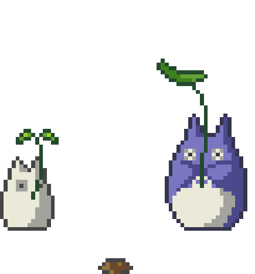

  

# ✿ About Me:
I'm currently working on a simple sudoku solver for those of us who want to seem smart (but can't quite get them finished (∩‿∩)  ). I love gaming and at the moment, I am aiming to recreate a game I created on scratch 5 years ago called SpaceDog! Music is a passion of mine and I love to create playlists dedicated to the current project. (See my current project playlist below!)

   
   
   

# ♡ Tech Stack:
               
# ☆ GitHub Stats:

### ★ Top Contributed Repo

---

